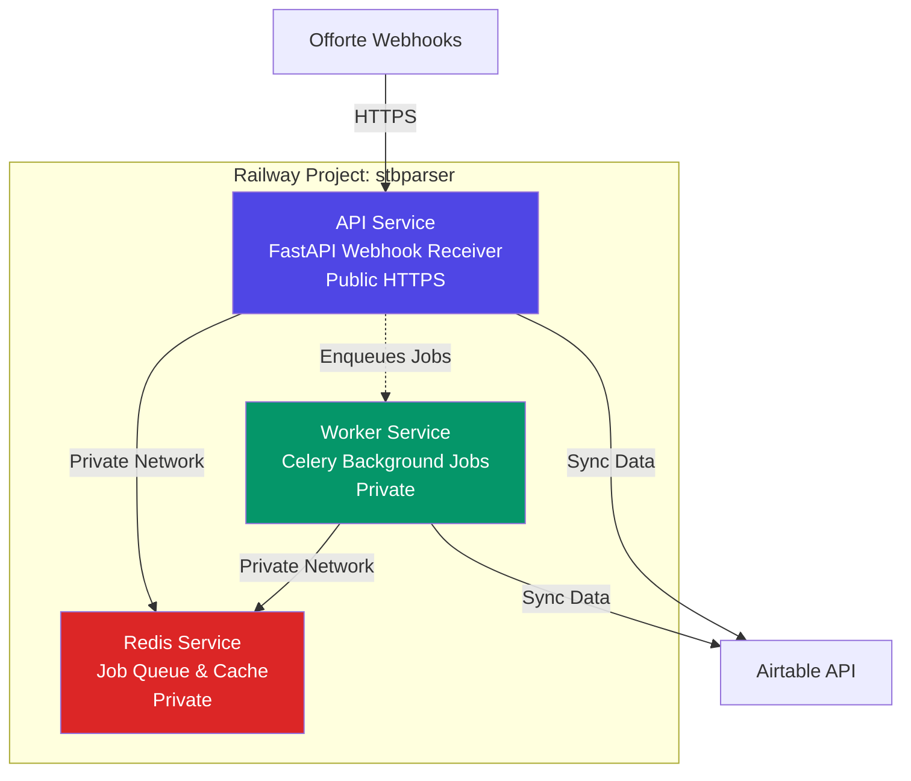

# Railway Deployment Guide - stbparser

**Status:** ✅ Deployed and Configured
**Date:** 2025-10-27
**Railway Project:** `stbparser` (`95d27c3f-5d3b-4b61-8868-aeaddf173ec8`)

---

## 🚀 Deployment Summary

Successfully consolidated **stbparser** into a single Railway project with 3 services:



---

## 📦 Services Configuration

### 1. **Redis Service**
- **ID:** `8b3d4457-a52a-4f79-a72b-0444b61a3df2`
- **Image:** `redis:7-alpine`
- **Type:** Private (internal networking only)
- **Purpose:** Job queue broker & result backend for Celery

**Private Network URL:**
```
redis://Redis.railway.internal:6379
```

---

### 2. **API Service** (FastAPI)
- **ID:** `70a323d2-8750-499e-8d9a-4ed07d24cb41`
- **Source:** GitHub `Romainnoo145/stbparser`
- **Config:** `railway.api.json`
- **Type:** Public (exposed via HTTPS)
- **Purpose:** Webhook receiver for Offorte proposal events

**Start Command:**
```bash
uvicorn backend.api.server:app --host 0.0.0.0 --port $PORT
```

**Health Check:** `/health`

**Exposed Endpoints:**
- `GET /` - Root endpoint
- `POST /webhook/offorte` - Webhook receiver
- `GET /health` - Health check

---

### 3. **Worker Service** (Celery)
- **ID:** `86bc6ec6-0f90-45ea-80d8-7ed113a32fd9`
- **Source:** GitHub `Romainnoo145/stbparser`
- **Config:** `railway.worker.json`
- **Type:** Private (no public access)
- **Purpose:** Background processing for proposal sync

**Start Command:**
```bash
celery -A backend.workers.worker worker --loglevel=info
```

---

## 🔐 Environment Variables

All critical environment variables have been configured for both API and Worker services:

### Shared Variables (Both API & Worker)
| Variable | Value | Purpose |
|----------|-------|---------|
| `REDIS_URL` | `redis://Redis.railway.internal:6379` | Redis connection (private network) |
| `OFFORTE_API_KEY` | `H7E...XJ` | Offorte API authentication |
| `OFFORTE_ACCOUNT_NAME` | `stb-kozijnen` | Offorte account identifier |
| `AIRTABLE_API_KEY` | `pat...ebf` | Airtable API authentication |
| `AIRTABLE_BASE_STB-ADMINISTRATIE` | `appuXCPmvIwowH78k` | Airtable base ID |
| `AIRTABLE_BASE_STB-SALES` | `app9mz6mT0zk8XRGm` | Airtable base ID |
| `LLM_API_KEY` | `sk-proj-...` | OpenAI API key |
| `LLM_MODEL` | `gpt-4o` | LLM model selection |
| `WEBHOOK_SECRET` | `generate_random_secret_for_signature_validation` | Webhook security |
| `APP_ENV` | `production` | Environment mode |
| `LOG_LEVEL` | `INFO` | Logging verbosity |

### API-Specific Variables
| Variable | Value | Purpose |
|----------|-------|---------|
| `RAILWAY_CONFIG_FILE` | `railway.api.json` | Railway config file |

### Worker-Specific Variables
| Variable | Value | Purpose |
|----------|-------|---------|
| `RAILWAY_CONFIG_FILE` | `railway.worker.json` | Railway config file |

---

## 📋 Railway Config Files

### `railway.api.json`
```json
{
  "$schema": "https://railway.app/railway.schema.json",
  "build": {
    "builder": "DOCKERFILE",
    "dockerfilePath": "Dockerfile"
  },
  "deploy": {
    "startCommand": "uvicorn backend.api.server:app --host 0.0.0.0 --port $PORT",
    "restartPolicyType": "ON_FAILURE",
    "restartPolicyMaxRetries": 3,
    "healthcheckPath": "/health",
    "healthcheckTimeout": 30
  }
}
```

### `railway.worker.json`
```json
{
  "$schema": "https://railway.app/railway.schema.json",
  "build": {
    "builder": "DOCKERFILE",
    "dockerfilePath": "Dockerfile"
  },
  "deploy": {
    "startCommand": "celery -A backend.workers.worker worker --loglevel=info",
    "restartPolicyType": "ON_FAILURE",
    "restartPolicyMaxRetries": 3
  }
}
```

---

## 🔄 Deployment Workflow

### Automatic Deployments
Railway automatically deploys when you push to GitHub:

```bash
cd /home/klarifai/.clientprojects/stbparser
git add .
git commit -m "Your commit message"
git push origin main
```

Both API and Worker services will rebuild and redeploy automatically.

---

## ✅ Manual Deployment Steps (If Needed)

1. **Trigger API Deployment:**
   ```bash
   railway service deploy API --project stbparser
   ```

2. **Trigger Worker Deployment:**
   ```bash
   railway service deploy Worker --project stbparser
   ```

3. **View Logs:**
   ```bash
   railway logs --service API
   railway logs --service Worker
   ```

---

## 🧪 Testing the Deployment

### 1. Check API Health
```bash
curl https://your-api-url.railway.app/health
```

Expected response:
```json
{
  "status": "healthy",
  "redis": "connected"
}
```

### 2. Test Webhook Endpoint
```bash
curl -X POST https://your-api-url.railway.app/webhook/offorte \
  -H "Content-Type: application/json" \
  -d '{"test": "data"}'
```

### 3. Monitor Worker Logs
Check Railway dashboard for Celery worker logs:
- Should show "celery@worker ready"
- Should show task processing when webhooks arrive

---

## 🔧 Troubleshooting

### Service Not Starting
1. Check Railway deployment logs
2. Verify environment variables are set
3. Check Dockerfile builds successfully
4. Verify Redis service is running

### Redis Connection Issues
- Ensure `REDIS_URL=redis://Redis.railway.internal:6379`
- Verify Redis service is running (check Railway dashboard)
- Check private networking is enabled

### Worker Not Processing Jobs
1. Verify Worker service is running
2. Check Worker logs for errors
3. Ensure Redis URL is correct
4. Verify Celery configuration in `backend/workers/worker.py`

### API Webhook Timeouts
- Ensure jobs are queued (not processed synchronously)
- Check Redis connection
- Verify Worker service is consuming jobs

---

## 📊 Monitoring

### Railway Dashboard
Access your services at:
```
https://railway.app/project/95d27c3f-5d3b-4b61-8868-aeaddf173ec8
```

### Key Metrics to Monitor
- **API:** Request rate, response time, error rate
- **Worker:** Job throughput, queue length, task failures
- **Redis:** Memory usage, connection count

---

## 🔒 Security Checklist

✅ API keys stored as environment variables (not in code)
✅ Redis accessible only via private network
✅ Worker service not publicly exposed
✅ Webhook secret configured for validation
✅ HTTPS enforced on API endpoint

---

## 📝 Next Steps

1. **Configure Offorte Webhook URL**
   - Go to Offorte settings
   - Update webhook URL to: `https://your-api-url.railway.app/webhook/offorte`
   - Select event: `proposal_won`

2. **Test End-to-End Flow**
   - Create/win a test proposal in Offorte
   - Verify webhook received in API logs
   - Check Worker processes the job
   - Confirm data synced to Airtable

3. **Set Up Monitoring (Optional)**
   - Add Sentry for error tracking
   - Configure uptime monitoring
   - Set up alerting for failures

---

## 🗑️ Old Projects Cleanup

The following projects can be deleted after verifying the new setup works:
- `stbparser-api` (`684371c0-1ec1-4f28-9bd8-43f38e835a54`)
- `stbparser-redis` (`71bc4c11-ba59-4d6b-8109-0d1cde91f855`)
- `stbparser-worker` (`a4595270-7727-44b0-8f71-4fbea128cd90`)

**⚠️ Only delete after confirming new deployment works!**

---

## 📚 Additional Resources

- **Railway Docs:** https://docs.railway.com
- **Project README:** [README.md](README.md)
- **Sync Status:** [SYNC_STATUS.md](SYNC_STATUS.md)
- **Testing Plan:** [TESTING_PLAN.md](TESTING_PLAN.md)

---

**Deployment completed by Agent Girl** 🤖
**Date:** 2025-10-27
