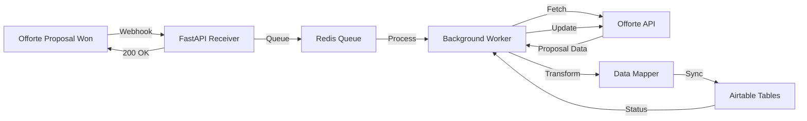

# Offorte-to-Airtable Sync Agent - Complete Implementation PRP

## PROJECT OVERVIEW

**What We're Building**: An automated sync agent that listens for accepted proposals in Offorte and instantly syncs all proposal data to multiple Airtable bases for operations management.

**The Core Flow**:
```
1. Customer accepts proposal in Offorte
2. Offorte sends webhook (proposal_won event)
3. Agent fetches complete proposal data via API
4. Agent transforms data to match Airtable schemas
5. Creates/updates records in 6 Airtable tables
6. Confirms sync status back to Offorte
```

**Business Value**: 
- Eliminates 30+ minutes manual data entry per quote
- Zero data entry errors
- Instant visibility in operations systems
- Automatic invoice scheduling (30/65/5 splits)

---

## TECHNICAL REQUIREMENTS

### API Integrations Required

**Offorte Side**:
- Authentication: API Key (simpler than OAuth2)
- Base URL: `https://connect.offorte.com/api/v2/{account_name}/`
- Rate limit: 30 requests per minute
- Webhook timeout: Must respond within 5 seconds

**Airtable Side**:
- Authentication: Bearer token (API Key)
- Base URL: `https://api.airtable.com/v0/{base_id}/`
- Rate limit: 5 requests per second
- Batch limit: 10 records per create/update request

### Environment Variables
```env
# Offorte Configuration
OFFORTE_API_KEY=your_api_key_here
OFFORTE_ACCOUNT_NAME=your_account_name

# Airtable Configuration
AIRTABLE_API_KEY=your_airtable_key
AIRTABLE_BASE_ADMINISTRATION=appXXXXXXXXXXXXX
AIRTABLE_BASE_SALES_REVIEW=appYYYYYYYYYYYYY
AIRTABLE_BASE_TECHNISCH=appZZZZZZZZZZZZZ

# Server Configuration
WEBHOOK_SECRET=generated_secret_for_validation
REDIS_URL=redis://localhost:6379
SERVER_PORT=8000
```

---

## DATA FLOW ARCHITECTURE

### Complete System Flow


### Webhook Processing (Must be FAST)
```python
@app.post("/webhook/offorte")
async def receive_webhook(request: Request):
    # 1. Validate signature (security)
    # 2. Parse event type
    # 3. Queue for processing (don't process inline!)
    # 4. Return 200 immediately (< 5 seconds)
    
    payload = await request.json()
    
    if payload["type"] == "proposal_won":
        await redis_queue.push({
            "proposal_id": payload["data"]["id"],
            "event": "proposal_won",
            "timestamp": payload["date_created"]
        })
    
    return {"status": "accepted"}
```

---

## FEATURE SPECIFICATION

### Core Functionality

The agent must:

1. **Listen for Offorte Events**
   - Handle `proposal_won` as primary trigger
   - Support `proposal_details_updated` for changes
   - Validate webhook signatures for security
   - Respond within 5-second timeout

2. **Fetch Complete Proposal Data**
   - Get proposal details with all line items
   - Retrieve customer/contact information
   - Extract custom fields and pricing
   - Handle Dutch language content (€ formatting, special chars)

3. **Transform Data for Airtable**
   - Map Offorte fields → Airtable columns
   - Parse construction elements (Merk blocks)
   - Identify coupled elements (D1, D2 variants)
   - Calculate derivative fields (hours, dates)

4. **Sync to 6 Airtable Tables**
   - `inmeetplanning`: Project scheduling (18 min per element)
   - `facturatie`: Invoice records (30%, 65%, 5% splits)
   - `elementen_review`: Individual element specifications
   - `klantenportaal`: Customer information
   - `deur_specificaties`: Door-specific details
   - `projecten`: Overall project administration

5. **Handle Errors Gracefully**
   - Retry failed API calls with exponential backoff
   - Queue failed syncs for manual review
   - Log all operations for debugging
   - Never lose data

---

## TOOLS & FUNCTIONS SPECIFICATION

```python
# Tool 1: Webhook Handler
async def handle_offorte_webhook(
    payload: dict,
    signature: str,
    secret: str
) -> dict:
    """
    Validates and processes incoming webhooks.
    
    Expected payload:
    {
        "type": "proposal_won",
        "date_created": "2025-01-15 14:30:00",
        "data": {
            "id": 12345,
            "name": "Offerte 2025001NL",
            "status": "won",
            "total_price": 45000.00,
            "company_id": 678,
            "contact_ids": [234, 235]
        }
    }
    
    Returns: {"status": "queued", "job_id": "xxx"}
    """

# Tool 2: Fetch Proposal
async def fetch_proposal_complete(
    proposal_id: int,
    include_content: bool = True
) -> dict:
    """
    Fetches full proposal data from Offorte API.
    
    Endpoints used:
    - GET /proposals/{id}
    - GET /proposals/{id}/content (if include_content=True)
    - GET /companies/{company_id}
    - GET /contacts/{contact_id}
    
    Returns complete proposal with nested data.
    """

# Tool 3: Parse Elements
def extract_proposal_elements(
    proposal_content: dict
) -> list:
    """
    Extracts construction elements from proposal.
    
    Identifies:
    - Merk blocks (e.g., "Merk 1: Voordeur")
    - Element types (Draaikiep, Vast raam, etc.)
    - Dimensions (1200x2400mm)
    - Coupled variants (D1. D2. D3)
    - Locations/positions
    - Individual pricing
    
    Returns list of normalized elements.
    """

# Tool 4: Calculate Invoices
def generate_invoice_splits(
    total_amount: float,
    order_number: str,
    project_date: str
) -> list:
    """
    Creates 3 invoice records for Dutch construction terms.
    
    Splits:
    - 30% vooraf (immediate)
    - 65% bij start (project_date)
    - 5% bij oplevering (project_date + 60 days)
    
    Returns 3 invoice dictionaries with amounts and dates.
    """

# Tool 5: Airtable Sync
async def sync_to_airtable(
    base_id: str,
    table_name: str,
    records: list,
    key_field: str = None
) -> dict:
    """
    Creates/updates records in Airtable.
    
    Features:
    - Batch operations (max 10 records)
    - Upsert logic if key_field provided
    - Automatic retry on rate limits
    - Field validation before sync
    
    Returns: {
        "created": 5,
        "updated": 2,
        "failed": 0,
        "record_ids": ["rec123", "rec456"]
    }
    """

# Tool 6: Complete Pipeline
async def process_won_proposal(
    proposal_id: int
) -> dict:
    """
    End-to-end processing of accepted proposal.
    
    Steps:
    1. Fetch from Offorte
    2. Transform data
    3. Sync to all 6 Airtable tables
    4. Update Offorte with sync status
    
    Returns complete sync report.
    """
```

---

## DATA MAPPING SPECIFICATIONS

### Offorte → Airtable Field Mappings

#### Table: klantenportaal (Customer Portal)
```python
{
    "Bedrijfsnaam": proposal["company"]["name"],
    "Adres": proposal["company"]["street"],
    "Postcode": proposal["company"]["zipcode"],
    "Plaats": proposal["company"]["city"],
    "Email": proposal["company"]["email"],
    "Telefoon": proposal["company"]["phone"],
    "Contact Persoon": proposal["contacts"][0]["name"],
    "Offerte Nummer": proposal["proposal_nr"],
    "Status": "Actief"
}
```

#### Table: elementen_review (Elements)
```python
# For each element extracted:
{
    "Order Nummer": proposal["proposal_nr"],
    "Element ID": f"{proposal_nr}_{element_index}",
    "Type": element["type"],  # e.g., "Draaikiep raam"
    "Merk": element["brand"],  # e.g., "Merk 1"
    "Locatie": element["location"],
    "Breedte (mm)": element["width"],
    "Hoogte (mm)": element["height"],
    "Gekoppeld": element["coupled"],  # True if D1/D2
    "Variant": element["variant"],  # "D1", "D2", etc.
    "Prijs": element["price"],
    "Opmerkingen": element["notes"]
}
```

#### Table: facturatie (Invoicing)
```python
# Generate 3 records:
[
    {
        "Order Nummer": proposal["proposal_nr"],
        "Factuur Type": "30% - Vooraf",
        "Bedrag": total * 0.30,
        "Datum": today(),
        "Status": "Concept"
    },
    {
        "Order Nummer": proposal["proposal_nr"],
        "Factuur Type": "65% - Start",
        "Bedrag": total * 0.65,
        "Datum": project_start_date,
        "Status": "Gepland"
    },
    {
        "Order Nummer": proposal["proposal_nr"],
        "Factuur Type": "5% - Oplevering",
        "Bedrag": total * 0.05,
        "Datum": project_end_date,
        "Status": "Gepland"
    }
]
```

#### Table: inmeetplanning (Measurement Planning)
```python
{
    "Order Nummer": proposal["proposal_nr"],
    "Klant": proposal["company"]["name"],
    "Aantal Elementen": len(elements),
    "Geschatte Tijd (min)": len(elements) * 18,
    "Geplande Datum": proposal["measurement_date"],
    "Status": "Te plannen",
    "Toegewezen aan": None  # Manual assignment
}
```

#### Table: projecten (Projects)
```python
{
    "Project Nummer": proposal["proposal_nr"],
    "Naam": proposal["name"],
    "Klant": proposal["company"]["name"],
    "Totaal Bedrag": proposal["total_price"],
    "Start Datum": proposal["project_date"],
    "Eind Datum": add_days(proposal["project_date"], 60),
    "Status": "Gewonnen",
    "Verantwoordelijke": proposal["account_user_name"],
    "Offorte ID": proposal["id"]
}
```

#### Table: deur_specificaties (Door Specifications)
```python
# Only for door elements:
{
    "Order Nummer": proposal["proposal_nr"],
    "Deur Type": element["door_type"],
    "Model": element["model"],
    "Kleur": element["color"],
    "Glastype": element["glass_type"],
    "Sluitwerk": element["locks"],
    "Speciale Kenmerken": element["special_features"]
}
```

---

## DEPENDENCIES

```python
# requirements.txt
fastapi==0.109.0
uvicorn==0.27.0
redis==5.0.1
httpx==0.26.0  # For async HTTP calls
pyairtable==2.2.0
pydantic==2.5.0
pydantic-settings==2.1.0
python-dotenv==1.0.0
celery==5.3.0  # Background tasks
```

---

## SYSTEM PROMPTS

### Main Agent Prompt
```
You are an integration agent connecting Offorte proposals to Airtable CRM.

Your responsibilities:
1. Process webhook events from Offorte immediately (< 5 sec response)
2. Fetch complete proposal data when quotes are accepted
3. Transform Dutch construction quotes to Airtable schemas
4. Create records across 6 operational tables
5. Calculate payment splits (30% vooraf, 65% bij start, 5% oplevering)
6. Handle all errors gracefully with retries

Data flow rules:
- Never process synchronously in webhook handler
- Always validate data before Airtable writes
- Preserve Offorte IDs for reference
- Handle Dutch special characters (ë, ï, €)
- Parse coupled elements (D1, D2) as separate records
- Calculate 18 minutes per element for planning

Error handling:
- Retry API calls 3 times with exponential backoff
- Queue failed syncs for manual review
- Log all operations with correlation IDs
- Never lose data - implement idempotent operations
```

---

## EXAMPLES & REFERENCES

- `examples/webhook_handler/` - FastAPI webhook receiver patterns
- `examples/airtable_sync/` - Batch operations and upsert logic
- `examples/dutch_parser/` - Parsing Dutch construction terminology
- `n8n_workflow.json` - Original workflow with field mappings
- `offorte-mcp-server/` - Reference MCP implementation (optional)

---

## DOCUMENTATION

- Offorte API: https://www.offorte.com/api-docs/
- Offorte Webhooks: https://www.offorte.com/api-docs/webhooks
- Airtable API: https://airtable.com/developers/web/api/introduction
- FastAPI: https://fastapi.tiangolo.com/
- Celery Tasks: https://docs.celeryq.dev/

---

## OTHER CONSIDERATIONS

### Critical Implementation Notes

1. **Webhook Response Time**
   - MUST respond in < 5 seconds
   - Queue for async processing
   - Never do API calls in webhook handler

2. **Rate Limiting**
   - Offorte: 30 req/min (implement throttling)
   - Airtable: 5 req/sec (use batch operations)

3. **Data Integrity**
   - Use Offorte proposal_id as unique key
   - Implement upsert logic to prevent duplicates
   - Transaction-like operations where possible

4. **Dutch Language**
   - Handle € formatting (1.234,56 not 1,234.56)
   - Special characters: ë, ï, ö, ü
   - Date format: DD-MM-YYYY

5. **Coupled Elements**
   - "D1. D2" means two related door variants
   - Create separate records but mark as coupled
   - Maintain relationship via shared element_group_id

6. **Error Recovery**
   - Exponential backoff: 2s, 4s, 8s, 16s
   - Dead letter queue after 3 retries
   - Manual retry endpoint for ops team
   - Daily reconciliation report

7. **Monitoring**
   - Track sync success rate
   - Alert on > 5 failures/hour
   - Log response times for APIs
   - Dashboard for sync status

8. **Security**
   - Validate webhook signatures
   - Store API keys in environment only
   - No sensitive data in logs
   - HTTPS only for all endpoints

---

## SUCCESS CRITERIA

The implementation is complete when:
- [ ] Webhook receives and queues events in < 1 second
- [ ] Proposal data syncs to all 6 tables correctly
- [ ] Invoice splits calculate properly (30/65/5)
- [ ] Coupled elements handled as separate records
- [ ] Error handling with retries works
- [ ] All Dutch special characters display correctly
- [ ] No duplicate records created on re-sync
- [ ] Monitoring dashboard shows real-time status
- [ ] 99.9% uptime for webhook endpoint
- [ ] Zero data loss guarantee implemented